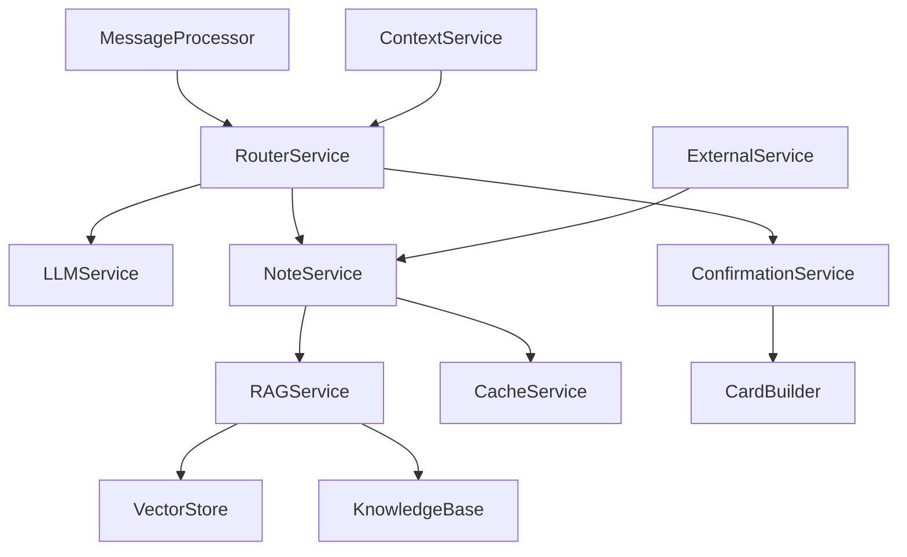

# AI路由系统 MVP 开发规划

## 📋 项目概述

**目标**：为飞书机器人开发AI辅助的智能路由系统，支持自然语言触发笔记记录、查询和管理功能。

**核心价值**：
- 🎯 **智能识别**：2字符快捷指令 + AI意图识别双重保障
- 📝 **高效记录**：可撤销编辑机制，支持快速修正
- 🔍 **智能查询**：多知识库RAG检索，支持跨库查询
- 👥 **多用户架构**：为未来团队协作和权限管理做好准备

---

## 🚀 MVP 四阶段规划

### 阶段1：AI Router核心服务 + 可撤销编辑机制
**时间预估**：3-5天
**目标**：用户可以通过自然语言触发笔记记录和查询，支持高效的可撤销编辑

#### 实施内容
1. **LLMService** - Gemini API集成
   - 意图识别和置信度评估
   - 内容分类和知识库推荐
   - 错误处理和重试机制

2. **RouterService** - 智能路由核心
   - 2字符快捷指令精确匹配
   - AI意图识别备选方案
   - 置信度阈值控制（>60%）

3. **NoteService** - 多用户笔记管理
   - 用户数据隔离（/data/users/{user_id}/）
   - 基础笔记CRUD操作
   - 单知识库支持（default）

4. **ConfirmationService** - 可撤销编辑
   - 临时操作缓存机制
   - 高效编辑卡片交互
   - 30分钟自动确认

5. **MessageProcessor集成**
   - 路由逻辑集成到现有消息处理流程
   - 保持原有功能兼容性

6. **AppController服务注册**
   - 新服务注册和依赖管理
   - 配置文件更新

#### 验收标准
- ✅ `jl 今天学到了XXX` → 显示确认卡片，支持快速编辑
- ✅ 确认卡片交互流畅，编辑步骤简化（点击直接编辑）
- ✅ `cx 昨天记录了什么` → 成功查询返回（含用户隔离）
- ✅ `py 测试语音` → 原有TTS功能正常
- ✅ AI意图识别准确率 >80%，置信度显示正确
- ✅ 多用户数据完全隔离，无串用风险

#### 技术实现要点
```python
# 核心服务架构
Module/Services/
├── llm/
│   ├── __init__.py
│   ├── llm_service.py          # Gemini集成
│   └── intent_classifier.py    # 意图分类器
├── router/
│   ├── __init__.py
│   ├── router_service.py       # 路由核心
│   └── command_matcher.py      # 指令匹配
├── note/
│   ├── __init__.py
│   ├── note_service.py         # 笔记管理
│   └── knowledge_base.py       # 知识库操作
└── confirmation/
    ├── __init__.py
    ├── confirmation_service.py # 确认机制
    └── card_builder.py         # 卡片构建
```

---

### 阶段2：多知识库 + RAG查询系统
**时间预估**：4-6天
**目标**：支持多个知识库的智能分类和RAG检索查询

#### 实施内容
1. **多知识库架构**
   - 知识库配置管理（work, personal, learning等）
   - 智能分类算法（关键词+LLM）
   - 跨知识库查询支持

2. **RAGService** - 检索增强生成
   - 向量化存储和索引
   - 语义相似度搜索
   - 上下文整合和回答生成

3. **查询语法扩展**
   - 单库查询：`cx work 项目进展`
   - 多库查询：`cx work,personal 时间管理`
   - 全局查询：`cx * 学习笔记`

4. **知识库管理界面**
   - 知识库创建/删除/重命名
   - 内容迁移和合并功能

#### 验收标准
- ✅ `jl 工作会议记录` → 自动分类到work知识库
- ✅ `cx work 上周的项目讨论` → 准确检索相关内容
- ✅ `cx *` → 全局搜索所有知识库
- ✅ RAG查询准确率 >85%，响应时间 <3秒
- ✅ 智能分类准确率 >90%

#### 技术实现要点
```python
# RAG系统架构
Module/Services/rag/
├── __init__.py
├── rag_service.py              # RAG核心服务
├── vector_store.py             # 向量存储
├── retriever.py                # 检索器
└── generator.py                # 生成器

# 知识库配置示例
/data/users/{user_id}/config/knowledge_bases.json
{
  "default": {"name": "默认", "keywords": []},
  "work": {"name": "工作", "keywords": ["会议", "项目", "任务"]},
  "personal": {"name": "个人", "keywords": ["生活", "健康", "爱好"]},
  "learning": {"name": "学习", "keywords": ["课程", "笔记", "技能"]}
}
```

---

### 阶段3：高级缓存 + 上下文管理
**时间预估**：3-4天
**目标**：优化用户体验，支持复杂的上下文对话和批量操作

#### 实施内容
1. **上下文管理系统**
   - 对话历史跟踪
   - 上下文相关的智能建议
   - 多轮对话支持

2. **高级缓存机制**
   - 批量操作支持
   - 定时自动提交
   - 操作历史和回滚

3. **智能建议系统**
   - 基于历史的知识库推荐
   - 内容补全和优化建议
   - 相关笔记推荐

4. **性能优化**
   - 查询结果缓存
   - 向量索引优化
   - 异步处理机制

#### 验收标准
- ✅ 连续对话保持上下文，智能推荐相关操作
- ✅ 批量操作支持，30分钟自动提交缓存操作
- ✅ 查询响应时间优化至 <2秒
- ✅ 智能建议准确率 >75%

#### 技术实现要点
```python
# 上下文管理
Module/Services/context/
├── __init__.py
├── context_service.py          # 上下文管理
├── conversation_tracker.py     # 对话跟踪
└── suggestion_engine.py        # 建议引擎

# 缓存优化
Module/Services/cache/
├── enhanced_cache.py           # 增强缓存
├── batch_processor.py          # 批量处理
└── auto_commit.py              # 自动提交
```

---

### 阶段4：外部平台集成 + Markdown文档支持
**时间预估**：5-7天
**目标**：支持本地Markdown和飞书文档/Notion的双向同步

#### 实施内容
1. **本地Markdown文件管理**
   - Markdown文件的读写和解析
   - 文件变更监控和同步
   - 版本控制集成

2. **外部平台集成**
   - 飞书文档API集成
   - Notion API集成（可选）
   - 双向同步机制

3. **文档变更监控**
   - 实时变更检测
   - 自动RAG索引更新
   - 冲突解决机制

4. **导入导出功能**
   - 批量导入外部文档
   - 知识库导出为Markdown
   - 格式转换和优化

#### 验收标准
- ✅ 支持本地Markdown文件编辑和同步
- ✅ 可以从飞书文档导入笔记到知识库
- ✅ 修改飞书文档自动更新RAG索引
- ✅ 支持导出知识库到外部平台
- ✅ 文档同步准确率 >95%，延迟 <5分钟

#### 技术实现要点
```python
# 外部集成
Module/Services/external/
├── __init__.py
├── markdown_service.py         # Markdown处理
├── feishu_sync.py             # 飞书同步
├── notion_sync.py             # Notion同步
└── file_monitor.py            # 文件监控

# 同步配置
/data/users/{user_id}/config/sync_config.json
{
  "markdown": {"enabled": true, "path": "./docs/"},
  "feishu": {"enabled": false, "folder_id": ""},
  "notion": {"enabled": false, "database_id": ""}
}
```

---

## 📊 整体技术架构

### 服务依赖关系


### 数据存储结构
```
/data/
├── users/
│   └── {user_id}/
│       ├── knowledge_bases/
│       │   ├── default/
│       │   ├── work/
│       │   ├── personal/
│       │   └── learning/
│       ├── config/
│       │   ├── knowledge_bases.json
│       │   ├── preferences.json
│       │   └── sync_config.json
│       ├── cache/
│       │   ├── pending_operations.json
│       │   ├── vector_cache/
│       │   └── query_cache/
│       └── exports/
└── shared/
    ├── templates/
    └── models/
```

---

## 🎯 关键成功指标

### 功能指标
- **路由准确率** >90% (快捷指令100% + AI识别80%+)
- **查询响应时间** <3秒 (阶段2) → <2秒 (阶段3)
- **编辑操作效率** 平均3步内完成确认
- **多用户隔离** 100%安全，无数据串用

### 用户体验指标
- **学习成本** <10分钟掌握基本操作
- **日常使用** 支持高频笔记记录和查询
- **错误恢复** 所有操作可撤销，误操作成本低

### 技术指标
- **系统稳定性** 99%+ 可用性
- **扩展性** 支持新知识库类型和外部平台
- **维护性** 模块化设计，单个服务可独立更新

---

## 🔄 迭代和反馈机制

### 每阶段验收流程
1. **功能验收**：按验收标准逐项测试
2. **性能验收**：响应时间和准确率测试
3. **用户体验验收**：实际使用场景测试
4. **代码审查**：架构设计和代码质量检查

### 持续优化
- **用户反馈收集**：每阶段收集使用反馈
- **性能监控**：关键指标持续监控
- **功能迭代**：基于反馈优化和扩展功能

---

## ✅ 开发准备就绪

**架构设计** ✅ 完成
**MVP规划** ✅ 完成
**技术选型** ✅ 确定
**验收标准** ✅ 明确

**🚀 现在可以开始阶段1的具体开发了！**

---

*文档版本：v1.0*
*最后更新：2025年6月*
*下一步：开始阶段1 - LLMService开发*