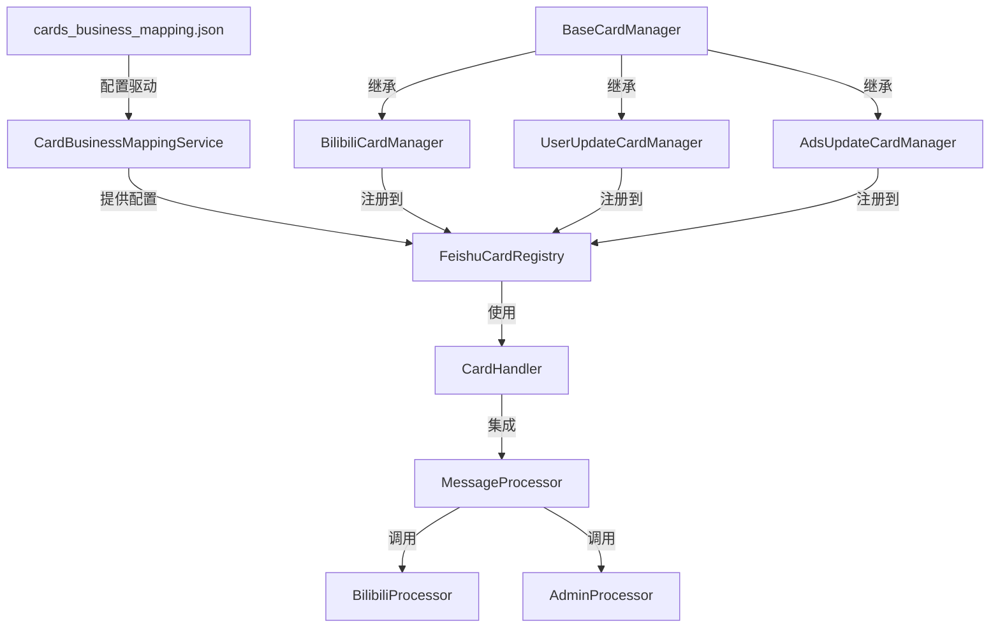

# 🎨 飞书卡片模块架构总结

**文档版本**: 3.0.0
**最后更新**: 2025-01-03
**适用版本**: Project_Feishu_Bot v3.x

## 📋 概述

本文档总结飞书卡片模块的完整架构实现，基于配置驱动的设计理念，实现了高度模块化、可扩展的卡片管理系统。

## 🏗️ 架构演进历程

### 第一代: 硬编码实现
- 卡片逻辑分散在各处
- 修改需要改动多个文件
- 扩展性差，维护困难

### 第二代: 模板化改进
- 引入卡片管理器概念
- 统一模板处理
- 仍需手动注册管理器

### 第三代: 配置驱动架构 (当前)
- 完全配置化的卡片管理
- 自动发现和注册机制
- 零修改扩展新卡片类型

## 🎯 核心设计理念

### 1. 配置驱动 (Configuration-Driven)
- 所有卡片配置集中在 `cards_business_mapping.json`
- 运行时动态加载和解析配置
- 业务逻辑与配置完全分离

### 2. 插件化架构 (Plugin Architecture)
- 每个卡片管理器都是独立插件
- 支持热插拔，不影响其他模块
- 统一的插件接口标准

### 3. 责任分离 (Separation of Concerns)
```
├── 配置层: cards_business_mapping.json
├── 服务层: CardBusinessMappingService
├── 管理层: BaseCardManager + 具体实现
├── 注册层: FeishuCardRegistry
├── 处理层: CardHandler
└── 业务层: 各种Processor
```

## 🔧 技术架构详解

### 核心组件关系图



### 数据流向

```
用户点击卡片
    ↓
飞书回调事件
    ↓
CardHandler.handle_feishu_card()
    ↓
转换为MessageContext
    ↓
MessageProcessor.process_message()
    ↓
路由到具体业务处理器
    ↓
返回ProcessResult
    ↓
根据response_type分发处理
    ↓
生成飞书响应/发送新消息
```

## 📁 文件组织结构

```
Module/
├── Adapters/feishu/cards/
│   ├── __init__.py                 # 卡片模块初始化和自动注册
│   ├── card_registry.py           # 基础管理器和注册表
│   ├── bilibili_cards.py          # B站卡片管理器
│   ├── user_update_cards.py       # 用户更新卡片管理器
│   └── ads_update_cards.py        # 广告更新卡片管理器
├── Services/
│   ├── card_business_mapping_service.py  # 配置映射服务
│   └── router/card_builder.py     # AI路由卡片构建器
└── Business/processors/
    ├── bilibili_processor.py      # B站业务处理器
    └── admin_processor.py         # 管理员业务处理器

cards_business_mapping.json        # 核心配置文件
```

## ⚙️ 配置文件规范

### business_mappings 结构
```json
{
  "业务标识": {
    "response_type": "响应类型标识",
    "card_config_key": "关联的卡片配置键",
    "processor": "业务处理器名称",
    "timeout_seconds": 30,
    "description": "业务描述"
  }
}
```

### card_configs 结构
```json
{
  "卡片配置键": {
    "reply_modes": "回复模式(new/reply/thread)",
    "class_name": "管理器类名",
    "module_path": "完整模块路径",
    "template_id": "飞书模板ID",
    "template_version": "模板版本号"
  }
}
```

## 🎭 卡片类型实现分析

### 1. B站视频卡片
**文件**: `bilibili_cards.py`
**业务ID**: `bili_video_menu`
**特色功能**:
- 主视频+附加视频列表展示
- 已读状态实时更新
- Android/Web链接适配

**模板参数结构**:
```json
{
  "main_title": "主视频标题",
  "main_priority": "优先级",
  "main_duration_str": "时长",
  "main_author": "作者",
  "main_source": "来源",
  "main_upload_date_str": "上传日期",
  "main_summary": "摘要",
  "main_url": "网页链接",
  "main_android_url": "安卓链接",
  "main_is_read_str": "已读状态文本",
  "main_is_read": "已读状态布尔值",
  "action_info": "操作信息",
  "addtional_videos": ["附加视频列表"]
}
```

### 2. 用户更新卡片
**文件**: `user_update_cards.py`
**业务ID**: `update_user`
**特色功能**:
- 交互式用户类型选择
- 实时状态更新
- 操作确认机制

**交互组件**:
- `confirm_action`: 确认操作
- `cancel_action`: 取消操作
- `user_type_selector`: 用户类型选择器

### 3. 广告时间更新卡片
**文件**: `ads_update_cards.py`
**业务ID**: `update_ads`
**特色功能**:
- 时间编辑器组件
- 批量时间戳更新
- 管理员权限控制

## 🔍 关键技术特性

### 1. 装饰器安全体系
```python
@card_build_safe("错误消息")          # 卡片构建安全
@card_operation_safe("错误消息")      # 卡片操作安全
@message_conversion_safe("错误消息")  # 消息转换安全
```

### 2. 常量统一管理
- `CardActions`: 卡片动作类型
- `ResponseTypes`: 响应类型
- `CardConfigKeys`: 配置键名
- `UIElements`: UI元素类型

### 3. 自动注册机制
```python
def initialize_card_managers(app_controller=None):
    """配置驱动的自动注册"""
    # 从配置文件获取所有管理器定义
    card_definitions = card_mapping_service.get_all_definition()

    # 动态导入和注册
    for card_type, definition in card_definitions.items():
        module = __import__(definition['module_path'], fromlist=[definition['class_name']])
        manager_class = getattr(module, definition['class_name'])
        manager_instance = manager_class(app_controller=app_controller)
        card_registry.register_manager(card_type, manager_instance)
```

### 4. 配置验证机制
- 启动时验证配置文件完整性
- 模板ID和版本检查
- 管理器注册状态监控

## 📊 性能与监控

### 性能特性
- **配置缓存**: 配置文件一次加载，内存缓存
- **延迟加载**: 管理器按需实例化
- **单例模式**: 注册表全局唯一实例

### 监控体系
- **日志追踪**: 完整的操作日志链
- **错误上报**: 统一的错误处理和上报
- **状态检查**: 卡片操作状态实时监控

## 🚀 扩展能力

### 零代码扩展
仅需修改配置文件即可:
1. 添加新的业务映射
2. 定义卡片配置
3. 系统自动发现和加载

### 热插拔支持
- 运行时动态注册新管理器
- 移除不影响现有功能
- 完全向后兼容

## 🎯 最佳实践总结

### 开发规范
1. **继承BaseCardManager**: 所有管理器必须继承基类
2. **实现必要方法**: `get_card_type_name()`, `get_supported_actions()`, `build_card()`
3. **使用装饰器**: 保证异常安全
4. **配置优先**: 避免硬编码

### 命名规范
- 文件名: `{business}_cards.py`
- 类名: `{Business}CardManager`
- 配置键: 小写下划线分隔

### 测试策略
- 单元测试: 每个管理器独立测试
- 集成测试: 端到端卡片流程测试
- 配置测试: 配置文件格式验证

## 🔮 未来演进方向

### 1. 模板管理增强
- 模板版本自动迁移
- 模板A/B测试支持
- 可视化模板编辑器

### 2. 性能优化
- 卡片渲染缓存
- 异步卡片加载
- 批量操作优化

### 3. 监控告警
- 卡片使用统计
- 性能指标监控
- 异常告警机制

### 4. 智能化升级
- AI驱动的卡片推荐
- 用户行为分析
- 个性化卡片体验

## 📝 维护指南

### 日常维护
- 定期检查配置文件一致性
- 监控卡片操作成功率
- 及时更新模板版本

### 问题排查
1. 检查配置文件格式
2. 验证管理器注册状态
3. 查看详细错误日志
4. 确认模板ID有效性

### 版本升级
1. 备份现有配置
2. 更新代码和配置
3. 验证兼容性
4. 灰度发布测试

---

*本文档将随着卡片模块的演进持续更新，确保与实际实现保持同步。*