# 📋 飞书卡片架构 - 基于官方模板+参数

## 🎯 设计理念

基于您提出的架构思路，将卡片管理从Business层分离，迁移到feishu_adapter下，采用飞书官方推荐的**模板+参数**方式。

## 📁 架构结构

```
Module/Adapters/feishu_cards/
├── __init__.py              # 模块入口
├── bilibili_cards.py        # B站卡片管理器
└── README.md               # 本文档
```

## 🔄 工作流程

### 1. 发送卡片流程

```mermaid
graph LR
    A[用户操作] --> B[Business层获取原始数据]
    B --> C[返回bili_video_data类型]
    C --> D[FeishuAdapter接收]
    D --> E[BilibiliCardManager]
    E --> F[格式化模板参数]
    F --> G[调用飞书API发送]
```


### 2. 卡片回调流程

```mermaid
graph LR
    A[用户点击卡片] --> B[FeishuAdapter接收回调]
    B --> C[BilibiliCardManager处理]
    C --> D[解析回调参数]
    D --> E[更新Business数据]
    E --> F[重新格式化参数]
    F --> G[调用飞书API更新卡片]
```


## 🛠️ 核心组件

### BilibiliCardManager

**成对方法设计**：
- `send_bili_video_menu_card()` - 发送卡片
- `update_bili_video_menu_card()` - 更新卡片
- `handle_bili_video_card_callback()` - 处理回调
- `_format_bili_video_params()` - 格式化参数

**模板管理**：
```python
self.templates = {
    'bili_video_menu': {
        'template_id': 'AAqBPdq4sxIy5',  # 正式模板ID
        'template_version': '1.0.2'
    }
}
```

## 📝 使用示例

### Business层 - 只返回原始数据
```python
def process_bili_video_async(self, user_id: str) -> ProcessResult:
    # ... 获取视频数据 ...
    video_data = {
        'main_video': main_video,
        'additional_videos': additional_videos
    }
    return ProcessResult.success_result("bili_video_data", video_data)
```

### FeishuAdapter层 - 调用卡片管理器
```python
def _handle_bili_video_async(self, original_data, user_id: str):
    result = self.message_processor.bilibili.process_bili_video_async(user_id)
    if result.success and result.response_type == "bili_video_data":
        video_data = result.response_content
        user_open_id = self._get_user_open_id_from_data(original_data, user_id)

        # 使用卡片管理器发送
        success = self.bili_card_manager.send_bili_video_menu_card(
            self.client, user_open_id, video_data
        )
```

### 参数格式化示例
```python
def _format_bili_video_params(self, video_data: Dict[str, Any]) -> Dict[str, Any]:
    main_video = video_data.get('main_video', {})
    additional_videos = video_data.get('additional_videos', [])

    # 格式化为飞书模板参数
    template_params = {
        'main_title': main_video.get('title', ''),
        'main_pageid': str(main_video.get('pageid', '')),
        'main_priority': self._format_priority(main_video.get('priority', 0)),
        'addtional_videos': [...]  # 格式化附加视频
    }
    return template_params
```

## 🎨 飞书API调用示例

### 发送卡片
```python
# 构建内容
content = {
    "data": {
        "template_id": "AAqBPdq4sxIy5",
        "template_variable": template_params,
        "template_version_name": "1.0.2"
    },
    "type": "template"
}

# 构造请求
request = CreateMessageRequest.builder() \
    .receive_id_type("open_id") \
    .request_body(CreateMessageRequestBody.builder()
        .receive_id(user_open_id)
        .msg_type("interactive")
        .content(json.dumps(content))
        .build()) \
    .build()

# 发起请求
response = client.im.v1.message.create(request)
```

### 更新卡片
```python
# 使用同样的content结构
request = PatchMessageRequest.builder() \
    .message_id(message_id) \
    .request_body(PatchMessageRequestBody.builder()
        .content(json.dumps(content))
        .build()) \
    .build()

# 发起更新
response = client.im.v1.message.patch(request)
```

## 🔧 回调处理

### 回调数据结构
```json
{
    "action": {
        "value": {
            "action": "mark_bili_read",
            "pageid": "123"
        },
        "tag": "button",
        "form_value": {}
    },
    "context": {
        "open_message_id": "om_x100b4b20c5529abcef",
        "open_chat_id": "oc_6f2b48554b615abcef"
    }
}
```

### 处理流程
```python
def handle_bili_video_card_callback(self, callback_data: Dict[str, Any]) -> Dict[str, Any]:
    action_value = callback_data.get('action', {}).get('value', {})
    action_type = action_value.get('action', '')

    if action_type == 'mark_bili_read':
        pageid = action_value.get('pageid', '')
        message_id = callback_data.get('context', {}).get('open_message_id', '')

        return {
            'action_type': 'mark_read',
            'pageid': pageid,
            'message_id': message_id,
            'success': True
        }
```

## ✅ 架构优势

1. **严格分离**: Business层不再关心卡片格式，只返回原始数据
2. **官方规范**: 使用飞书推荐的模板+参数方式
3. **成对设计**: 发送、更新、回调处理成对管理
4. **集中维护**: 模板ID和版本集中在卡片管理器中
5. **易于扩展**: 新增卡片类型只需添加新的管理器类

## 🔄 扩展指南

### 添加新卡片类型
1. 在`feishu_cards/`下创建新的管理器类
2. 实现成对方法：`send_xxx_card()`, `update_xxx_card()`, `handle_xxx_callback()`
3. 在`FeishuAdapter`中集成新管理器
4. 更新`__init__.py`导出新管理器

### 更新模板信息
```python
card_manager.update_template_info('bili_video_menu', 'new_template_id', 'new_version')
```

## 🚀 实际效果

通过这个架构，成功实现了：
- ✅ B站视频菜单卡片的发送（使用正式模板ID）
- ✅ 已读状态的实时更新
- ✅ 卡片点击回调处理
- ✅ 业务逻辑与展示完全分离

符合您提出的所有设计要求！

# 飞书卡片管理架构

## 架构概述

基于飞书官方模板+参数方式的卡片管理系统，提供统一的接口和扩展机制。

### 核心组件

1. **BaseCardManager** - 基础卡片管理器抽象类
2. **FeishuCardRegistry** - 卡片注册中心
3. **具体卡片管理器** - 继承BaseCardManager的具体实现

## 架构设计

```
feishu_cards/
├── __init__.py           # 模块入口，全局注册中心
├── base_card_manager.py  # 基础类和注册中心
├── bilibili_cards.py     # B站卡片管理器
└── README.md            # 本文档
```

## 使用方式

### 1. 获取卡片管理器

```python
from Module.Adapters.feishu_cards import get_card_manager

# 获取B站卡片管理器
bili_manager = get_card_manager("bilibili")

# 发送卡片
response = bili_manager.send_bili_video_menu_card(chat_id, bili_data, feishu_api)

# 更新卡片
response = bili_manager.update_bili_video_menu_card(open_message_id, bili_data, feishu_api)

# 处理回调
result = bili_manager.handle_bili_video_card_callback(action_value, context_data)
```

### 2. 查看可用卡片类型

```python
from Module.Adapters.feishu_cards import list_available_cards

available = list_available_cards()
print(available)  # {'bilibili': 'B站', 'music': '音乐'} 示例
```

## 添加新卡片类型

### 步骤1：创建卡片管理器

```python
# 示例：music_cards.py
from .base_card_manager import BaseCardManager

class MusicCardManager(BaseCardManager):
    def get_card_type_name(self) -> str:
        return "音乐"

    def _initialize_templates(self):
        self.templates = {
            "music_player": {
                "template_id": "YOUR_TEMPLATE_ID",
                "template_version": "1.0.0"
            }
        }

    def send_music_player_card(self, chat_id: str, music_data: dict, feishu_api):
        """发送音乐播放卡片"""
        template_params = self._format_music_params(music_data)
        content = self._build_template_content("music_player", template_params)

        payload = {
            "receive_id": chat_id,
            "content": content,
            "msg_type": "interactive"
        }

        response = feishu_api.send_message(payload)
        if response.get('success', False):
            self._log_success("发送")
        else:
            self._log_error("发送", response.get('message', '未知错误'))
        return response

    def _format_music_params(self, music_data: dict) -> dict:
        """格式化音乐数据参数"""
        return {
            "title": music_data.get('title', ''),
            "artist": music_data.get('artist', ''),
            "duration": str(music_data.get('duration', 0))
        }
```

### 步骤2：注册到系统

在 `__init__.py` 的 `initialize_card_managers()` 函数中添加：

```python
def initialize_card_managers():
    # 现有的B站注册
    bili_manager = BilibiliCardManager()
    card_registry.register_manager("bilibili", bili_manager)

    # 新增音乐卡片注册
    from .music_cards import MusicCardManager
    music_manager = MusicCardManager()
    card_registry.register_manager("music", music_manager)

    return card_registry
```

### 步骤3：在适配器中使用

```python
# 在feishu_adapter.py中
music_manager = get_card_manager("music")
response = music_manager.send_music_player_card(chat_id, music_data, self.feishu_api)
```

## 设计原则

### 1. 成对方法设计
每个卡片类型包含三类方法：
- **发送方法组**: `send_xxx_card()`
- **更新方法组**: `update_xxx_card()`
- **回调处理组**: `handle_xxx_callback()`

### 2. 参数格式化
- 业务层返回原始数据
- 卡片管理器负责格式化为模板参数
- 使用 `_format_xxx_params()` 方法

### 3. 统一接口
- 继承 `BaseCardManager`
- 实现必要的抽象方法
- 使用统一的模板构建和日志记录

### 4. 集中管理
- 通过注册中心统一管理
- 支持动态获取和列表查询
- 便于维护和扩展

## 模板管理

### 更新模板信息

```python
# 单个管理器更新
bili_manager.update_template_info("bili_video_menu", "NEW_TEMPLATE_ID", "2.0.0")

# 批量更新所有管理器的同名模板
card_registry.update_all_template_info("common_template", "NEW_ID", "2.0.0")
```

### 获取模板信息

```python
template_info = bili_manager.get_template_info("bili_video_menu")
print(template_info)  # {"template_id": "AAqBPdq4sxIy5", "template_version": "1.0.2"}
```

## 注意事项

1. **模板ID管理**: 确保使用正确的飞书官方模板ID
2. **参数格式**: 严格按照模板要求格式化参数
3. **错误处理**: 使用基类提供的日志方法记录操作结果
4. **性能考虑**: 避免在卡片管理器中执行重业务逻辑
5. **扩展性**: 新卡片类型应遵循现有的命名和结构约定