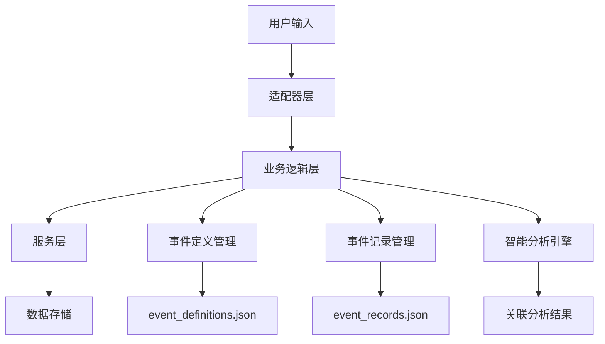

# 日常事项记录系统 (Routine Record System) 开发框架

## 📋 系统概述

日常事项记录系统是一个用于记录和管理用户日常活动的业务模块，支持复杂的事件属性管理、智能关联分析和多适配器兼容。系统设计核心思想是**事件定义与记录分离**，为未来的数据分析和智能提醒提供结构化基础。

### 🎯 设计目标

1. **结构化记录**：将日常活动转化为可分析的结构化数据
2. **智能关联**：支持事件间的复杂关联关系（开始/结束、程度层次、时间关联等）
3. **适配器无关**：后台数据模型与前端展示方式解耦
4. **扩展友好**：为未来的AI分析、定时提醒、健康管理等功能预留接口
5. **向后兼容**：保持现有文字交互功能不变

## 🏗️ 架构设计

### 1+3层架构定位

```
📱 适配器层 (Adapters)
├── 飞书协议转换、事件处理、卡片交互
├── 未来扩展：Web界面、移动应用、语音助手

🧠 业务逻辑层 (Business)
├── routine_record.py - 核心业务逻辑
├── 事件路由、权限控制、数据验证

⚙️ 服务层 (Services)
├── 数据存储、配置管理、权限服务
├── 未来扩展：分析服务、提醒服务、同步服务

🔧 应用控制层 (Application)
├── 服务编排、生命周期管理
```

### 数据流向设计



## 📊 数据模型设计

### 核心设计原则

1. **事件定义与记录分离**：定义描述"什么是事件"，记录描述"事件何时发生"
2. **属性动态扩展**：支持为不同事件类型定义专属属性
3. **关联关系建模**：支持多层次的事件关联关系
4. **适配器特定配置**：为不同展示方式预留配置空间

## 🔄 交互流程设计

### MVP阶段开发计划

#### MVP1: 基础设施 ✅
- [x] 数据模型设计和实现
- [x] 用户独立文件夹存储
- [x] 权限配置集成
- [x] 数据迁移机制

#### MVP2: 文字交互 ✅
- [x] 前置指令识别 ("r "、"日程 "、"rs"、"查看日程")
- [x] 事项创建和记录流程
- [x] 查询和展示功能
- [x] 数字选择交互

#### MVP3: 查询增强 🟡
- [ ] 高级查询功能
- [ ] 时间范围筛选
- [ ] 分类和标签过滤
- [ ] 统计数据展示

#### MVP4: 卡片交互 🔲
- [ ] 事件创建确认卡片
- [ ] 属性设置交互卡片
- [ ] 查询结果展示卡片
- [ ] 批量操作支持

### 交互模式设计

#### 1. 快速记录模式（已实现）
```
用户输入: "r 刷牙"
系统判断:
  - 如果事件已存在 → 直接记录
  - 如果是新事件 → 进入设置流程
```

#### 2. 详细设置模式（MVP4）
```
新事件创建流程:
1. 基础信息设置（名称、类型、分类）
2. 关联关系设置（开始/结束关联、额外关联）
3. 显示属性设置（日常检查、周期）
4. 程度选项设置（如牙齿清洁层次）
5. 时间属性设置（未来事项日期、预估时长）
6. 备注和自定义字段
```

#### 3. 智能查询模式（MVP3+）
```
查询功能扩展:
- 时间范围查询: "查看本周的运动记录"
- 关联分析查询: "洗澡相关的所有活动"
- 统计报告查询: "本月刷牙频率统计"
- 趋势分析查询: "最近的作息规律分析"
```

## 🧩 关键业务逻辑

### 事件类型处理

#### 1. 瞬间完成 (instant)
- 特点：发生即完成，无持续时间
- 示例：吃维生素、测体重、记录想法
- 数据：记录时间戳即可

#### 2. 开始事件 (start)
- 特点：标记某活动的开始
- 示例：开始工作、开始运动、开始学习
- 关联：可能与结束事件配对

#### 3. 结束事件 (end)
- 特点：标记某活动的结束
- 示例：洗完澡、运动结束、工作完成
- 关联：必须指定关联的开始事件

#### 4. 长期持续 (ongoing)
- 特点：长期进行的状态或习惯
- 示例：使用护肤品、服用药物、学习课程
- 周期：需要定期检查和更新

#### 5. 未来事项 (future)
- 特点：计划在未来执行的事项
- 示例：体检预约、旅行计划、重要提醒
- 时间：包含目标执行时间

### 关联关系处理

#### 1. 开始/结束关联
```python
# 示例：洗澡活动
start_event = "开始洗澡"  # start类型
end_event = "洗完澡"      # end类型，关联到start_event

# 时长计算
duration = end_time - start_time
```

#### 2. 程度层次关联
```python
# 示例：牙齿清洁
base_event = "刷牙"
degrees = ["水牙线", "普通牙刷", "牙线清洁", "舌苔清洁"]

# 组合记录：一次完整的牙齿清洁可能包含多个程度
combined_record = {
    "event": "刷牙",
    "degrees": ["普通牙刷", "牙线清洁"],
    "duration": 8,  # 分钟
    "completeness": 0.75  # 完成度
}
```

#### 3. 额外关联事件
```python
# 示例：洗头与相关症状
primary_event = "洗头"
related_events = ["头痒", "头屑", "使用洗发水"]

# 分析关联：
# - 头痒、头屑 → 触发洗头
# - 洗发水使用量 → 评估消耗
# - 洗头频率 → 健康状态评估
```

### 数据分析设计

#### 1. 时间模式分析
```python
def analyze_time_patterns(user_id, event_name):
    """分析事件的时间模式"""
    records = get_event_records(user_id, event_name)

    # 分析维度
    patterns = {
        "daily_distribution": analyze_daily_pattern(records),
        "weekly_trend": analyze_weekly_trend(records),
        "frequency": calculate_frequency(records),
        "regularity": calculate_regularity_score(records)
    }

    return patterns
```

#### 2. 关联事件分析
```python
def analyze_event_correlations(user_id, primary_event):
    """分析事件关联性"""

    # 时间邻近性分析
    nearby_events = find_nearby_events(primary_event, time_window=30)

    # 频率关联分析
    frequency_correlation = analyze_frequency_correlation(primary_event, nearby_events)

    # 因果关系推断
    causal_relationships = infer_causal_relationships(primary_event, nearby_events)

    return {
        "nearby_events": nearby_events,
        "correlations": frequency_correlation,
        "causal_chains": causal_relationships
    }
```

#### 3. 健康状态评估
```python
def assess_health_indicators(user_id):
    """基于日常记录评估健康指标"""

    health_metrics = {
        "hygiene_score": calculate_hygiene_score(user_id),
        "activity_level": calculate_activity_level(user_id),
        "sleep_quality": estimate_sleep_quality(user_id),
        "routine_stability": calculate_routine_stability(user_id)
    }

    return health_metrics
```

## 🎨 前端适配器设计

### 卡片模板体系

#### 1. 事件创建确认卡片
- **功能**：新事件的属性设置和确认
- **要素**：事项名称、类型、分类、关联、程度、备注等10个核心要素
- **交互**：动态显示/隐藏相关字段，减少界面复杂度

#### 2. 快速记录卡片
- **功能**：已有事件的快速记录确认
- **要素**：事项名称、时间、程度、备注
- **交互**：一键确认或快速调整

#### 3. 查询结果卡片
- **功能**：展示查询结果和统计信息
- **要素**：事件列表、时间信息、统计图表、操作按钮
- **交互**：分页浏览、筛选排序、详情查看

#### 4. 分析报告卡片
- **功能**：展示数据分析结果和建议
- **要素**：图表展示、趋势分析、健康建议、行动计划
- **交互**：交互式图表、深度探索

### 适配器扩展接口

## 🔮 未来扩展方向

### 1. 智能分析引擎
```python
class RoutineAnalysisEngine:
    """日常记录智能分析引擎"""

    def detect_anomalies(self, user_id):
        """检测异常模式"""
        # 识别用户行为的异常变化
        pass

    def predict_future_needs(self, user_id):
        """预测未来需求"""
        # 基于历史数据预测用户可能的需求
        pass

    def generate_recommendations(self, user_id):
        """生成个性化建议"""
        # 提供改善建议和优化方案
        pass

    def health_risk_assessment(self, user_id):
        """健康风险评估"""
        # 基于日常数据评估健康风险
        pass
```

### 2. 智能提醒系统
```python
class SmartReminderService:
    """智能提醒服务"""

    def schedule_routine_reminders(self, user_id):
        """安排日常提醒"""
        # 基于用户习惯智能安排提醒时间
        pass

    def detect_missed_routines(self, user_id):
        """检测遗漏的日常事项"""
        # 识别用户可能忘记的重要事项
        pass

    def adaptive_reminder_timing(self, user_id, event_name):
        """自适应提醒时机"""
        # 学习用户最佳的提醒接收时间
        pass
```

### 3. 数据同步与备份
```python
class DataSyncService:
    """数据同步服务"""

    def sync_to_cloud(self, user_id):
        """同步到云端"""
        pass

    def sync_across_devices(self, user_id):
        """跨设备同步"""
        pass

    def export_data(self, user_id, format_type):
        """数据导出"""
        # 支持JSON、CSV、Excel等格式
        pass

    def import_data(self, user_id, data_source):
        """数据导入"""
        # 从其他系统导入数据
        pass
```


## 📈 性能优化策略

### 1. 数据存储优化
- **分片存储**：按时间分片存储记录数据，提高查询效率
- **索引优化**：为常用查询字段建立索引
- **压缩存储**：对历史数据进行压缩存储
- **缓存机制**：为频繁访问的数据建立缓存

### 2. 查询性能优化
- **预计算**：预先计算常用统计指标
- **分页加载**：大量数据分页加载
- **懒加载**：按需加载详细数据
- **异步处理**：复杂分析任务异步执行

### 3. 内存管理优化
- **对象池**：重用频繁创建的对象
- **弱引用**：对大量数据使用弱引用
- **及时清理**：及时释放不再使用的资源

## 🔒 安全与隐私

### 1. 数据安全
- **本地加密**：敏感数据本地加密存储
- **访问控制**：严格的用户权限验证
- **数据脱敏**：分析时对个人敏感信息脱敏
- **安全传输**：数据传输时使用加密连接

### 2. 隐私保护
- **最小化原则**：只收集必要的数据
- **用户控制**：用户可完全控制自己的数据
- **匿名分析**：群体分析时完全匿名化
- **数据留存**：定期清理过期数据

## 📝 开发指南

### 1. 代码规范
- 遵循项目现有的代码风格
- 所有方法都要有完整的文档字符串
- 使用类型提示提高代码可读性
- 编写单元测试覆盖核心逻辑

### 2. 部署注意事项
- 确保用户数据目录的写权限
- 配置适当的日志级别
- 监控存储空间使用情况
- 定期备份用户数据

## 🎯 里程碑规划

### 短期目标 (1-2月)
- [x] **MVP1-2完成**：基础文字交互功能稳定运行
- [ ] **MVP3完成**：高级查询和统计功能
- [ ] **MVP4完成**：完整卡片交互体验

### 中期目标 (3-6月)
- [ ] **智能分析**：基础的模式识别和异常检测
- [ ] **数据可视化**：图表展示和趋势分析
- [ ] **提醒系统**：智能提醒和习惯追踪

### 长期目标 (6月+)
- [ ] **健康管理**：综合健康状态评估
- [ ] **多端同步**：支持多设备数据同步
- [ ] **AI助手**：基于个人数据的智能建议

---

## 📚 技术参考

### 相关文档
- [项目架构文档](./TECHNICAL_ARCHITECTURE_REFERENCE.md)
- [飞书卡片开发指南](./Module/Adapters/feishu/cards/README.md)
- [业务处理器基类](./Module/Business/processors/base_processor.py)

### 性能基准
- 单次记录创建：< 100ms
- 查询1000条记录：< 500ms
- 数据迁移：< 2s
- 内存占用：< 50MB (1000用户)

---

*本文档将随着项目发展持续更新。如有疑问或建议，请参与项目讨论。*