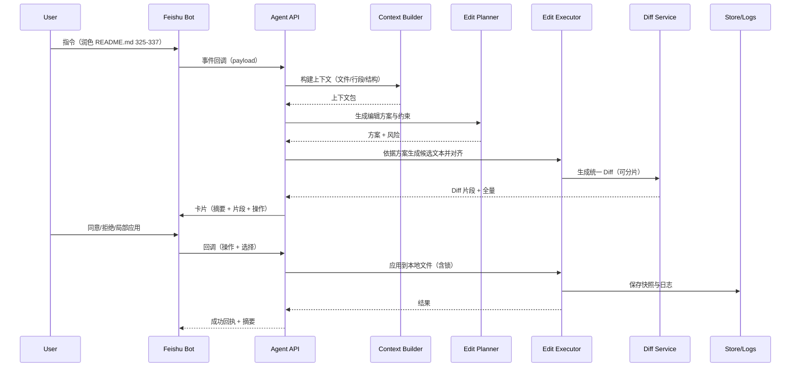

## Agent 驱动的文档编辑系统（Feishu Demo 阶段）产品与技术设计

### 背景与目标

- **目标**: 构建一个“会话驱动”的文档编辑代理（Agent），能够基于自然语言指令在受控范围内对本地仓库中的文档进行理解、规划、修改、对比、回滚，并通过飞书（Feishu/Lark）卡片进行交互审批与状态回执。
- **范围（MVP/Demo）**:
  - 客户端：飞书机器人 + 交互式卡片
  - 支持操作对象：本地仓库中的 Markdown/文本类文件（例如 `README.md`、`*.md`、`*.txt`）
  - 支持能力：
    - 指令解析与意图分类（润色、重写、结构化、合并、分块插入/删除、标题目录生成等）
    - 上下文构建（基于用户选区/引用行号/语义搜索）
    - 安全编辑（沙箱路径、只读白名单、文件锁）
    - Diff 生成与可视化、审批流（卡片“同意/拒绝/查看详情/局部应用”）
    - 变更落地（本地文件写入）与快速回滚
  - 非目标（MVP 之外）:
    - 对 `Module/Common` 目录中的任何引用、删改或新增（遵守外部库约束）
    - 非文本类二进制文件
    - 多分支 PR 工作流（可在后续扩展）

### 关键原则与约束

- **平台约束**: Windows 本地开发环境，路径均为本地，避免使用不兼容的系统方法。
- **外部库约束**: `Module/Common` 为外部公共库，未经允许不得引用、删改或添加其中内容。
- **可控性优先**: 所有编辑在“可审核”的流程中执行，先生成方案与 Diff，再通过卡片审批落地。
- **最小必要上下文**: 精准抽取与构建上下文，避免“多套备选方案一次尝试”的不确定行为。
- **无半成品代码**: 严禁引入 TODO/占位符式半成品；计划与实现分离到文档层记录。

---

## 一、用户体验（UX）与交互设计

### 1.1 典型用户故事（Use Cases）

- 作为使用者，我在飞书对机器人说：“润色 README.md 第 325-337 行并整理为待办清单，删除‘更新客户端’项”，机器人：
  1) 解析指令 → 2) 抽取上下文 → 3) 生成编辑方案 → 4) 产出 Diff → 5) 卡片展示 → 6) 我点击“同意” → 7) 本地写入并返回成功与摘要。
- 我可以对某段修改点击“查看详情”打开完整 Diff 页面（或以卡片分页显示），并可“仅应用所选 Hunk”。
- 我可以撤回最近一次应用的变更（单文件粒度或事务粒度）。

### 1.2 交互通道（MVP）

- 飞书机器人消息：
  - 指令触发：自然语言 + 结构化命令（例如“/edit README.md 325-337 润色成待办”）
  - 审批卡片：标题、修改要点摘要、Diff 预览（片段/分页）、操作按钮（同意、拒绝、查看完整diff、仅应用本段、回滚上一次变更）

### 1.3 卡片信息架构

- 标题：编辑意图 + 目标文件 + 行区间（可选）
- 概要：
  - 变更类型（润色/重写/结构化等）
  - 影响范围（行/字节/段落数）
  - 风险提示（例如跨章节重排、删除内容等）
- Diff 预览：
  - 采用统一 Diff 片段（最多 N 行/片段，支持分页）
  - 提供“展开更多”跳转链接或卡片二次拉取
- 操作区：
  - 同意并应用 / 拒绝
  - 局部应用（按 Hunk）
  - 查看完整 Diff（打开 Web 预览或返回长消息分段）
  - 回滚上一变更（确认弹层）

### 1.4 无障碍与反馈

- 重要动作均回执：应用成功/失败（含失败原因）
- 每次动作均附带简要摘要与“进一步操作”建议（例如“是否对目录自动重建？”）

---

## 二、信息组织与上下文构建策略

### 2.1 输入信号

- 显式参数：目标文件、行号范围、片段引用、操作类型、期望风格
- 隐式线索：历史会话、最近浏览/编辑痕迹、仓库结构（同名文件、邻近文档）

### 2.2 上下文构建流程

1) 校验与定位：
   - 路径校验（限制在工作区根目录内；拒绝 `Module/Common`）
   - 文件类型校验（仅文本/Markdown）
2) 语义抽取：
   - 基于行号/关键词/标题锚点抽取局部上下文（默认前后 30-60 行）
   - 若无明确范围，则进行轻量语义检索（章节标题、列表项、表格）
3) 结构理解：
   - Markdown 大纲解析（H1-H3 结构、列表、有序段落）
   - 段落语义边界识别，避免跨段误编辑
4) 编辑意图规划：
   - 识别操作类别：润色/重写/结构化/合并/拆分/排序/删除/语气统一/术语统一/示例补全
   - 风险评估：大范围重排、可能的语义漂移

### 2.3 生成与约束

- 生成策略：
  - 始终先产出“编辑方案 + 变化摘要 + 风险点”，不可直接落盘
  - 方案需保持单一策略，不可并列多套备选方案“碰运气”
- 约束：
  - 不引入 TODO/占位符
  - 保持格式与风格一致性（标题层级、列表风格、术语）
  - Windows 路径/编码安全（UTF-8 with BOM 兼容性校验可选）

---

## 三、工具层与系统架构设计

### 3.1 组件概览

- Bot 接入层（Feishu）：事件订阅、消息/卡片处理、鉴权
- 指令解析器：意图识别、参数解析、权限校验
- 上下文构建器：文件/片段获取、语义检索、结构解析
- 编辑规划器：编辑策略决策、风险评估、变更预估
- 编辑执行器（沙箱）：生成候选文本、对齐原文、构造 Diff
- Diff 服务：统一 Diff 生成、分片、反向补丁（回滚）
- 审批流控制：卡片生成与回调、局部应用
- 存储与审计：变更快照、操作日志、审计追踪

### 3.2 流程（顺序图/伪）



### 3.3 技术选型（建议）

- 服务端：Python（与现有项目一致），框架可选 FastAPI/Flask（已有 `api_service_main.py` 可复用服务形态）
- Feishu SDK：官方 Python SDK（事件回调、卡片发放与更新）
- 文本处理：Markdown 解析（如 `markdown-it-py`）、轻量分段器
- 检索：ripgrep/简单正则 + 章节标题/列表结构解析（MVP 阶段不引入复杂向量检索）
- Diff：标准 unified diff（`difflib.unified_diff`）+ 自定义分片与高亮
- 存储：本地快照目录 + 操作日志（JSON lines）

注意：严格避免涉及 `Module/Common` 的引用与更改。

---

## 四、Diff 展示与审批交互

### 4.1 Diff 生成策略

- 以“行”为单元生成 unified diff，保留上下文行（默认为 2-3 行，可配置）
- 大 Diff 分片：
  - 超过阈值（如 > 200 行变化或 > 5 个 hunk）则分段展示
  - 卡片仅展示前若干片段 + “展开更多”操作
- Hunk 级别操作：允许选择性应用部分 hunk（按行号映射）

### 4.2 Feishu 卡片示例（伪 JSON）

```json
{
  "config": {"wide_screen_mode": true},
  "header": {"title": {"tag": "plain_text", "content": "编辑建议 · README.md (L325-337)"}},
  "elements": [
    {"tag": "div", "text": {"tag": "lark_md", "content": "将零散笔记整理为待办清单，删除‘更新客户端’项。"}},
    {"tag": "hr"},
    {"tag": "div", "text": {"tag": "lark_md", "content": "```diff\n- 原始零散句子…\n+ 统一待办清单…\n```"}},
    {"tag": "action", "actions": [
      {"tag": "button", "text": {"tag": "plain_text", "content": "同意并应用"}, "type": "primary", "value": {"action": "apply"}},
      {"tag": "button", "text": {"tag": "plain_text", "content": "仅应用此片段"}, "value": {"action": "apply_hunk", "hunk_id": "h1"}},
      {"tag": "button", "text": {"tag": "plain_text", "content": "查看完整 Diff"}, "value": {"action": "view_full"}},
      {"tag": "button", "text": {"tag": "plain_text", "content": "拒绝"}, "type": "danger", "value": {"action": "reject"}}
    ]}
  ]
}
```

### 4.3 审批结果与回执规范

- 成功：返回“已应用 N 个 hunk，影响 X 行”，附简短变更摘要
- 拒绝：记录原因（可选手动输入），用于后续优化
- 回滚：直接应用反向补丁，回执“已回滚到版本 #<id>”

---

## 五、权限、安全与审计

- 文件访问控制：
  - 仅允许在工作区根内白名单路径（`.md`, `.txt` 等）
  - 拒绝 `Module/Common` 路径
  - 禁止相对路径逃逸（`..`）
- 并发与锁：
  - 单文件互斥锁；卡片交互含“正在编辑”态
- 审计：
  - 每次编辑记录输入指令、上下文摘要、方案、Diff 摘要、操作者、时间戳、回执
  - 存档快照：应用前后文本各一份（压缩可选）

---

## 六、服务接口与数据模型（MVP）

### 6.1 主要接口

- POST `/feishu/event`
  - 入参：飞书事件回调 payload
  - 出参：签名/挑战/卡片更新

- POST `/agent/plan`
  - 入参：`{ file_path, selection: {start,end}?, intent, instruction, user_id }`
  - 出参：`{ plan, risk, diff_preview, hunk_map, ticket_id }`

- POST `/agent/apply`
  - 入参：`{ ticket_id, apply_all?: bool, hunk_ids?: string[] }`
  - 出参：`{ success, applied_hunks, affected_lines, snapshot_id }`

- POST `/agent/rollback`
  - 入参：`{ snapshot_id }`
  - 出参：`{ success }`

### 6.2 数据模型（示意）

```json
// edit_ticket.jsonl（每行一条）
{
  "ticket_id": "t_20250808_001",
  "file_path": "README.md",
  "selection": {"start": 325, "end": 337},
  "intent": "polish_to_todo",
  "plan": "将零散句子统一转为待办清单，删除某项",
  "risk": ["语义漂移低"],
  "diff_preview": "--- a/README.md...",
  "hunk_map": [{"id":"h1","range":"325-340"}],
  "created_by": "feishu_user_123",
  "created_at": 1723090000
}
```

---

## 七、编辑执行器与对齐策略

### 7.1 变更对齐

- 在上下文段落边界进行替换，避免跨段落误伤
- 行号偏移处理：
  - 方案生成与 Diff 基于同一快照
  - 应用时再次校验上下文哈希（小概率冲突时二次对齐或提示手动干预）

### 7.2 失败与回退

- 应用失败（文件被外部改写/锁超时）：提示重试或重新规划
- 回滚：基于快照或反向补丁，保证 O(1) 次操作内恢复

---

## 八、度量指标与日志

- 成功率：计划→应用成功比
- 审批通过率：卡片“同意”占比
- 变更撤回率：回滚/应用次数
- 时延分解：指令→方案生成→Diff→审批→应用
- 风险提示命中率：是否发生大幅度删除/重排

---

## 九、测试策略（MVP）

- 单元：
  - 上下文构建（行抽取、标题解析、段落边界）
  - Diff 生成与分片
  - 路径校验与锁
- 集成：
  - 飞书事件回调、卡片交互回调
  - 方案生成→审批→应用→回滚闭环
- 端到端（E2E）：
  - 典型场景：润色、待办化、删除某项、回滚

---

## 十、里程碑与落地计划

- M0（1-2 天）
  - 飞书应用创建、事件订阅、机器人可回消息
  - 基础文件读写与路径安全校验
- M1（3-5 天）
  - 上下文构建器（行号/标题）与编辑规划器（有限意图）
  - Diff 生成与卡片片段展示
- M2（3-5 天）
  - 审批与局部应用、快照与回滚
  - 度量与日志
- M3（后续）
  - 更丰富的意图与风格控制、术语表
  - Web 预览端与多文件批量操作

---

## 十一、扩展到自有客户端的规划

- 独立 Web/桌面客户端：
  - 实时预览、侧边栏大纲、内嵌 Diff 视图、拖拽式 Hunk 选择
  - 本地代理进程 + IPC 调用，保持与飞书阶段相同服务接口
- 多端统一：相同的 `/agent/plan`、`/agent/apply` 协议，替换前端层即可

---

## 十二、示例工作流（基于本仓库场景）

1) 指令：
   - “润色 `README.md` 第 325-337 行为待办清单，并删除‘更新客户端’项”
2) 系统：
   - 校验路径与类型 → 抽取 L325-L360 上下文 → 规划“待办化 + 删除特定项”
   - 生成 Diff 并卡片展示摘要与片段
3) 用户：
   - 点击“同意并应用”
4) 系统：
   - 文件加锁 → 应用所选 hunk → 生成快照与日志 → 回执“完成”

---

## 附录 A：接口返回摘要规范

- 状态更新（进度流）：
  - “已解析指令 → 正在构建上下文 → 已生成方案 → 已生成 Diff → 等待审批 → 已应用/已拒绝 → 完成”
- 最终摘要：
  - “修改 `README.md`，应用 1 个 hunk，影响 12 行；删除项：‘更新客户端’；无格式/校验错误。”

---

## 十三、个人知识库（RAG + Tag）通用编辑流程设计

本章将需求从“针对单一文档的润色”推广到“多文档、基于 Tag 的检索增强与聚合编辑”。目标是：用户仅提供一段自然语言陈述，经路由匹配到主题 Tag（例如“信息论”），系统检索若干相关文档块，生成一套一致、可审核的编辑方案，最终以跨文档的最小必要修改落地。

### 13.1 场景输入与期望输出

- 输入：
  - 用户句子（例如：“家政阿姨更多其实是一个临时的打下手，我真正在乎的是提高决策密度，而不用自己亲自做完再想——哪怕这是认知间隔层面而不是绝对时间层面”。）
  - 路由策略已判定主题 Tag：`["信息论"]`
  - 知识库：若干 Markdown 文档（例如 `信息论与创业.md`, `我的个人倾向反思.md` 等）

- 输出：
  - 跨文档的编辑计划：对涉及文档的明确最小编辑（插入/改写/合并/链接/注释）
  - 统一 Diff（分文档、分 hunk，支持选择性应用）
  - Feishu 卡片展示：摘要 + 分片 Diff + 操作（同意/拒绝/局部应用/查看全文）

### 13.2 数据结构与函数调用（function_call）

- Chunk 结构（检索单元）：
```json
{
  "doc_path": "信息论与创业.md",
  "section_id": "sec-entropy-1",
  "title_path": ["信息论与创业", "决策密度"],
  "text": "……段落内容……",
  "start_line": 120,
  "end_line": 160,
  "tag_scores": {"信息论": 0.87, "创业": 0.74},
  "embedding_id": "emb_abc",
  "context_hash": "h_92c1f0"
}
```

- 自定义函数调用 Schema（示例）：
```json
{
  "name": "retrieve_chunks",
  "description": "按 tag + query 语义检索文档块",
  "parameters": {
    "type": "object",
    "properties": {
      "tags": {"type": "array", "items": {"type": "string"}},
      "query": {"type": "string"},
      "top_k": {"type": "integer", "default": 6}
    },
    "required": ["tags", "query"]
  }
}
```

```json
{
  "name": "build_outline",
  "description": "解析 Markdown 大纲和段落边界，为编辑对齐提供锚点",
  "parameters": {
    "type": "object",
    "properties": {"doc_path": {"type": "string"}},
    "required": ["doc_path"]
  }
}
```

```json
{
  "name": "generate_edit_plan",
  "description": "基于用户句子与检索块生成单一编辑计划（不可多方案并行）",
  "parameters": {
    "type": "object",
    "properties": {
      "user_utterance": {"type": "string"},
      "chunks": {"type": "array"},
      "constraints": {"type": "object"}
    },
    "required": ["user_utterance", "chunks"]
  }
}
```

```json
{
  "name": "apply_hunks",
  "description": "按 hunk 映射在本地文件执行最小必要修改（带上下文哈希校验）",
  "parameters": {
    "type": "object",
    "properties": {
      "doc_path": {"type": "string"},
      "hunks": {
        "type": "array",
        "items": {
          "type": "object",
          "properties": {
            "id": {"type": "string"},
            "context_hash": {"type": "string"},
            "start_line": {"type": "integer"},
            "end_line": {"type": "integer"},
            "patch": {"type": "string"}
          },
          "required": ["id", "context_hash", "patch"]
        }
      }
    },
    "required": ["doc_path", "hunks"]
  }
}
```

```json
{
  "name": "rollback_to_snapshot",
  "description": "按快照回滚指定文档",
  "parameters": {
    "type": "object",
    "properties": {"snapshot_id": {"type": "string"}},
    "required": ["snapshot_id"]
  }
}
```

### 13.3 多阶段提示词（Prompts）设计

- 路由后聚合提示（Aggregator Prompt）：
```
任务：根据用户陈述与已检索到的相关块，抽象“唯一的”编辑主张与意图边界。
要求：
1) 只输出一个编辑目标，不给出多套可选方案；
2) 明确目标涉及的文档、段落主题与期望变化类型（插入/改写/链接/注释）；
3) 给出必要的引用（chunk.section_id）以便后续对齐；
4) 识别风险（语义漂移、跨文档冲突）。
```

- 文档级编辑规划提示（Per-Doc Planner Prompt）：
```
输入：文档大纲、相关 chunk 与用户陈述
产出：该文档的最小编辑列表（按 hunk 粒度），每个 hunk 包含插入/替换的目标位置锚点与变更文本。
约束：
1) 保持文档风格与术语一致；
2) 优先在相关章节内编辑，不跨章节重排；
3) 如需新增小节，必须提供合适的标题与位置锚点；
4) 不引入 TODO 或占位描述。
```

- 引用与一致性校验提示（Citation Guard Prompt）：
```
对每个拟议修改，验证是否有检索块支撑；标注引用不足的变更并降低优先级或移除。
确保编辑文本中的关键论断能回指到 chunk.title_path/section_id。
```

- Diff 生成摘要提示（Diff Summarizer Prompt）：
```
将每个文档的 hunk 汇总为：
- 变化概述（插入/删除/替换数量）
- 影响范围（行/段落）
- 风险点（如“新增概念未在原文出现”）
输出用于卡片标题与摘要。
```

#### 13.3.5 LLM I/O Schema（严格 JSON）

- Aggregator（输入/输出）
  - 输入：
  ```json
  {
    "utterance": "用户原始一句话",
    "chunks": [/* 上文检索到的 chunk 列表（不含全文） */],
    "outlines_index": {
      "信息论与创业.md": {"titles": ["信息论与创业", "决策密度", "反馈回路与延迟"]},
      "我的个人倾向反思.md": {"titles": ["我的个人倾向反思", "过度亲为"]}
    }
  }
  ```
  - 输出（示例 Schema）：
  ```json
  {
    "intent_id": "kb.edit.intent/decision_density",
    "intent_title": "围绕‘决策密度/认知间隔’的跨文档最小编辑",
    "rationale": "基于 chunks[tag=信息论] 与相关小节，建议在A文档补充论述，在B文档追加操作化清单。",
    "targets": [
      {
        "doc_path": "信息论与创业.md",
        "sections": [{"section_id": "sec-entropy-1", "title_path": ["信息论与创业", "决策密度"]}]
      },
      {
        "doc_path": "我的个人倾向反思.md",
        "sections": [{"section_id": "sec-bias-3", "title_path": ["我的个人倾向反思", "过度亲为"]}]
      }
    ],
    "operations": [
      {"type": "insert", "doc_path": "信息论与创业.md", "section_id": "sec-entropy-1", "priority": 1},
      {"type": "insert", "doc_path": "我的个人倾向反思.md", "section_id": "sec-bias-3", "priority": 2}
    ],
    "constraints": {"single_strategy": true, "no_todo": true, "style_consistency": true},
    "risks": ["术语需统一：决策密度/信息增益/认知间隔"]
  }
  ```

- Per-Doc Plan（输入/输出）
  - 输入：
  ```json
  {
    "utterance": "用户原始一句话",
    "outline": {/* 目标文档的大纲与段落边界（精简，不含全文） */},
    "chunks": [/* 该文档相关 chunk */],
    "aggregation": {/* 上一步聚合结果（用于统一意图与约束） */}
  }
  ```
  - 输出（严格 Schema）：
  ```json
  {
    "doc_path": "信息论与创业.md",
    "style": {"terminology": ["决策密度", "信息增益", "认知间隔"]},
    "risks": ["无明显风险"],
    "hunks": [
      {
        "id": "h1",
        "op": "insert",
        "anchor": {"by": "section_id", "section_id": "sec-entropy-1", "position": "after_section_intro"},
        "context_hash_before": "h_92c1f0",
        "patch": "++ 为了提高决策密度，可以…（省略）",
        "citations": [{"chunk_id": "emb_abc", "section_id": "sec-entropy-1"}, {"section_id": "sec-feedback-2"}]
      }
    ]
  }
  ```

### 13.4 端到端伪代码（含函数调用）

```python
def kb_edit_pipeline(user_utterance: str, tags: list[str]):
    # 1) 检索相关块
    chunks = call("retrieve_chunks", {"tags": tags, "query": user_utterance, "top_k": 6})

    # 2) 构建涉及文档的大纲与边界
    docs = unique([c["doc_path"] for c in chunks])
    outlines = {doc: call("build_outline", {"doc_path": doc}) for doc in docs}

    # 3) 生成“唯一”的跨文档编辑主张（聚合器需要 outlines 摘要）
    aggregation = llm("AggregatorPrompt", input={
        "utterance": user_utterance,
        "chunks": chunks,
        "outlines_index": {doc: outlines[doc]["titles"] for doc in docs}
    })

    # 4) 按文档生成最小编辑计划（显式使用 generate_edit_plan 概念）
    per_doc_plans = {}
    for doc in docs:
        related_chunks = [c for c in chunks if c["doc_path"] == doc]
        per_doc_plans[doc] = call("generate_edit_plan", {
            "user_utterance": user_utterance,
            "chunks": related_chunks,
            "constraints": {"single_strategy": True, "no_todo": True, "style_consistency": True,
                             "aggregation": aggregation, "outline": outlines[doc]}
        })

    # 5) 引用/一致性校验与风险过滤（需 aggregation 约束）
    validated_plans = citation_guard(per_doc_plans, chunks, aggregation)

    # 6) 生成可应用的 hunk 与 unified diff
    diffs, hunk_maps = {}, {}
    for doc, plan in validated_plans.items():
        hunks = plan_to_hunks(plan, outlines[doc])  # 位置锚点→行号、context_hash 绑定
        diffs[doc] = build_unified_diff(doc, hunks)
        hunk_maps[doc] = hunks

    # 7) 构造卡片摘要（分文档、分片段）
    summary = llm("DiffSummarizerPrompt", input={"diffs": diffs, "aggregation": aggregation})
    card = build_feishu_card(summary, diffs, hunk_maps)

    return {"card": card, "hunk_maps": hunk_maps, "diffs": diffs, "aggregation": aggregation}


def apply_user_selection(selection):
    # selection: {doc_path: [hunk_ids]}
    snapshots = []
    for doc, hunk_ids in selection.items():
        hunks = load_hunks(doc, hunk_ids)
        # 逐 hunk 校验 context_hash → 防并发漂移
        snapshot_id = save_snapshot(doc)
        snapshots.append(snapshot_id)
        call("apply_hunks", {"doc_path": doc, "hunks": hunks})
    return {"snapshots": snapshots}
```

### 13.5 示例（基于“信息论”标签）

- 输入：
  - 用户句子：强调“提高决策密度”、“减少认知间隔”、无需事必躬亲。
  - Tag：`信息论`
  - 检索命中：
    - `信息论与创业.md`：
      - sec-entropy-1（决策密度/熵与选择代价）
      - sec-feedback-2（反馈回路与延迟）
    - `我的个人倾向反思.md`：
      - sec-bias-3（过度亲为的偏好）

- 规划结果（摘要）：（由 Aggregator 输出 + DiffSummarizer 二次压缩生成）
  - 在 `信息论与创业.md` 的“决策密度”小节补充一段“借助外部执行降低认知间隔，但保持信息增益”的论述，并链接到“反馈回路与延迟”。
  - 在 `我的个人倾向反思.md` 中，将“过度亲为”段落后追加“委托与验证清单”小列表，呼应“信息增益最大化”。

- 生成的 hunk（示意）：
```diff
--- a/信息论与创业.md
+++ b/信息论与创业.md
@@ 标题: 决策密度
+ 为了提高决策密度，可以通过将执行环节外包或并行化来缩短认知间隔；关键在于保留对信息增益的主导权，并以最小反馈延迟校验决策质量（参见本章“反馈回路与延迟”）。
```

```diff
--- a/我的个人倾向反思.md
+++ b/我的个人倾向反思.md
@@ 标题: 过度亲为
+ 委托与验证清单：
+ - 明确“信息增益”与“结果可验证”的界限
+ - 以里程碑验收代替全过程亲自执行
+ - 将时间投入于高不确定性决策而非稳定流程
```

- 卡片摘要（简）：
  - 文档 1：新增 1 段（决策密度小节），影响 ~4 行；引用：sec-entropy-1, sec-feedback-2
  - 文档 2：新增 1 个列表，影响 ~5 行；引用：sec-bias-3
  - 操作：同意全部 | 仅应用文档 1 | 仅应用所选 hunk | 查看全文 | 拒绝

### 13.6 约束与防护

- 单一方案：禁止并行多方案；若置信不足，明确“需要更多证据/上下文”而非给出多选。
- 锚点与哈希：hunk 绑定 `context_hash` 与标题锚；若环境变化，提示重新规划或手工合并。
- 跨文档一致性：术语表与风格器（可选）确保“信息增益/认知间隔/决策密度”等术语统一。
- 外部库隔离：拒绝编辑 `Module/Common`。

### 13.7 度量与测试补充

- 追加指标：
  - 检索精度@K、引用覆盖率、无引用变更比
  - hunk 应用成功率、冲突率
  - 语义漂移投诉率（主观标注）
- 测试场景：
  - 多文档同名章节；
  - 行号漂移（并发编辑）；
  - 大段新增与分片展示；
  - 低置信检索（应主动降权或放弃）。

